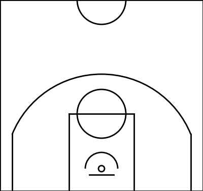

# 
Create NBA court in python

The code uses matplotlib to create an image of a basketball half court, with NBA dimensions from 
*[the official NBA website](https://official.nba.com/rule-no-1-court-dimensions-equipment/)*.

Inspired by the implementation from
*[this Medium article from user @namnguyen93](https://medium.com/@namnguyen93/a-quick-look-into-visualizing-nba-shot-data-24756665565b)*.

The resulting image will be used as background for projects to display shot charts.

To generate the empty court image, run `example.py`.

    Output image:

    

