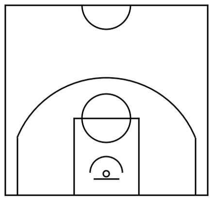

# 
Create NBA court in python

The code uses matplotlib to create an image of a basketball half court, with NBA dimensions from 
*[the official NBA website](https://official.nba.com/rule-no-1-court-dimensions-equipment/)*.

Inspired by and modified from the implementation in *[github repo](https://github.com/NammySosa/NBA-Shot-Data-2021-2022/tree/main) / [Medium article](https://medium.com/@namnguyen93/a-quick-look-into-visualizing-nba-shot-data-24756665565b)*, from Nam Nguyen,
that itself was based on the *[jupyter notebook](https://github.com/naveenv92/medium-articles/blob/master/articles/nba-shotchart/nba_shotchart.ipynb) / [Medium article](https://medium.com/data-science/make-a-simple-nba-shot-chart-with-python-e5d70db45d0d)* from Naveen Venkatesan. The main modification is to fix the 3pt line to be a circular arc instead of elliptical.

The resulting image will be used as background for projects to display shot charts.

To generate the empty court image, run `example.py`.

    Output image:

    

